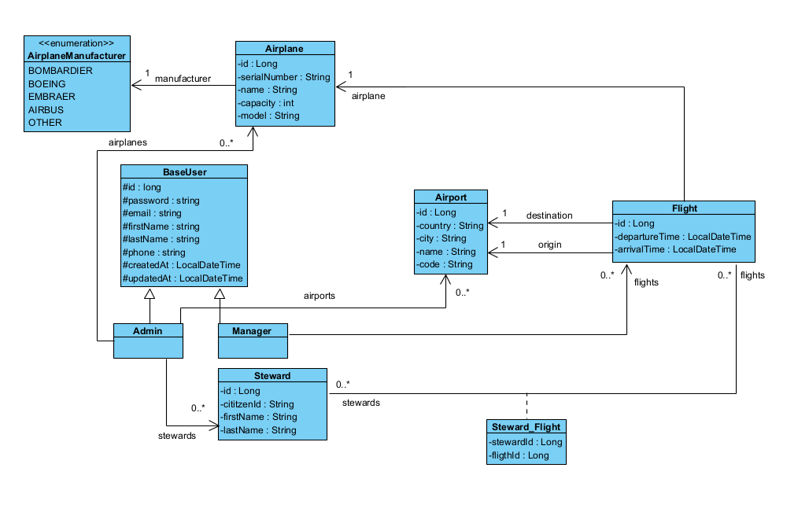
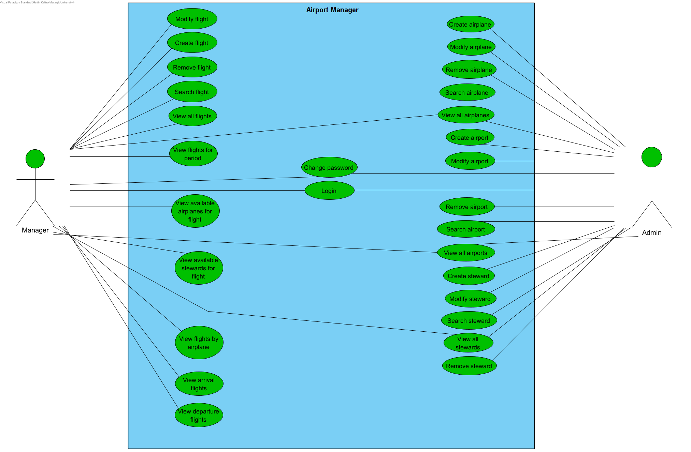

# PA165 Airport Manager Project

*PA165 course at MUNI Spring 2022.*

## Instructions

### How to run the app
- To **compile project and run tests** use: `mvn clean install`
- If your IDE **does not recognize Lombok's generated methods** make sure you have installed `Lombok plugin`
- If running a project from IDE make sure you **configured project structure to Java 11** (in Intellij Idea
  Ctrl+Alt+Shift+S).
- `cd module-web` move from root folder to the module designated for running the server
- `mvn spring-boot:run` to start the server
- open `http://localhost:8080/pa165` in the browser

### Users
Admins (login and password): velky@gmail.com hesloheslo5, janousek@gmail.com hesloheslo6 
Managers (login and password): sklenar@gmail.com hesloheslo, pospisil@gmail.com hesloheslo2, kral@gmail.com hesloheslo3, dvorak@gmail.com hesloheslo4

### REST API
- `cd module-rest` move to folder designated for running the server
- `mvn spring-boot:run` to start the server
- open `http://localhost:9090/pa165/rest` in the browser

#### Testing

1. Find all stewards
    - `curl -i -X GET http://localhost:9090/pa165/rest/stewards` 
    - This command returns all stewards in json format
2. Find a single steward
    - `curl -i -X GET http://localhost:9090/pa165/rest/stewards/{id}`
    - provide **ID** of steward
    - This command returns a single steward in json format
    - In case of non-existing id, **404 Not Found** is returned
3. Delete steward
    - `curl -i -X DELETE http://localhost:9090/pa165/rest/stewards/{id}`
    - provide **ID** of steward
    - This command deletes steward specified by ID
    - In case of non-existing id, **404 Not Found** is returned 
4. Create new steward
    - `curl -X POST -i -H "Content-Type: application/json" --data '{"firstName":"test","lastName":"test","citizenId":"test"}' http://localhost:9090/pa165/rest/stewards/create?userEmail=velky@gmail.com`
    - This command creates a new steward from body of request provided in json format
    - In case steward with specified **citizedID** already exists **422 Unprocessable Entity** is returned
    - In case user with **userEmail** doesn't exist **422 Unprocessable Entity** is returned
5. Update steward
    - `curl -X PUT -i -H "Content-Type: application/json" --data '{"firstName":"test","lastName":"test","citizenId":"test"}' http://localhost:9090/pa165/rest/stewards/{id}`
    - provide **ID** of steward
    - This command updates a steward with data from body of request provided in json format
    - In case of non-existing id, **404 Not Found** is returned 
6. Get stewards available for time period
    - `curl -i -X GET "http://localhost:9090/pa165/rest/stewards/available?from=2022-07-14 15:00&to=2022-07-16 15:00"`
    - provide **time interval** as URL parameter
    - This command returns stewards, that are available for given period. In this case, it returns stewards with **IDs** 3,4,5,6
    

## About Project

- **Name**: Airport Manager
- **Technologies**: Java 11, Spring Boot, Hibernate, Maven, Lombok
- **Developers**:
    - Matej Michálek @xmicha11
    - Kamil Fňukal @xfnukal
    - Pavel Sklenář @xsklena1
    - Martin Kalina @xkalina2
- **Assigment**:
    - Create an information system managing flight records at an airport. The system should allow the users to enter 
    records about stewards, airplanes and destinations. It should also be possible to update and delete these records. 
    A destination should contain at least the information about the location of an airport (country, city). Airplane 
    details should contain the capacity of the plane and its name (and possibly its type as well). A steward is 
    described by his first and last name. The system should also allow us to record a flight. When recording a flight, 
    it is necessary to set the departure and arrival times, the origin, the destination and the plane. The system should
     also check that the plane does not have another flight scheduled during the time of the this flight. It should also
      be possible to assign (remove) stewards to (from) a flight while checking for the steward's availability. The 
      ultimate goal is to have a system capable of listing flights ordered by date and displaying the flight details 
      (origin, destination, departure time, arrival time, plane, list of stewards).
      
### Project Description

Airport Manager is a simple information system for managing stewards, airplanes and flight schedule. 

### Roles

System has two authorization roles - **Admin** and **Manager**:

**Admin:**

Admin is a leading manager of the airport. He can do following actions:

- Log in to the information system.
- Can create, modify, search and remove an airplane(s). Admin can also view all airplanes in the information system.
- Can create, modify, search and remove an airport(s). Admin can also view all airports in the information system.
- Can create, modify, search and remove steward(s). Admin can also view all stewards in the information system.

Only limitation of the admin role is that admin **cannot manage flights** in any way.

**Manager:**

Manager is the regular manager of the Airport therefore the manager just can:

- Log in to the information system.
- Create, modify, remove and search for a flight(s). Manager can also view all flights in the information system.

Both user roles are allowed to change their passwords.

### Entities
- **Admin** - entity representing an admin
- **Airplane** - entity representing an airplane
- **Airport** - entity representing an airport
- **Manager** - entity representing a manager
- **Flight** - entity representing a scheduled flight from Airport A to Airport B
- **Steward** - entity representing a steward 

### Diagrams

